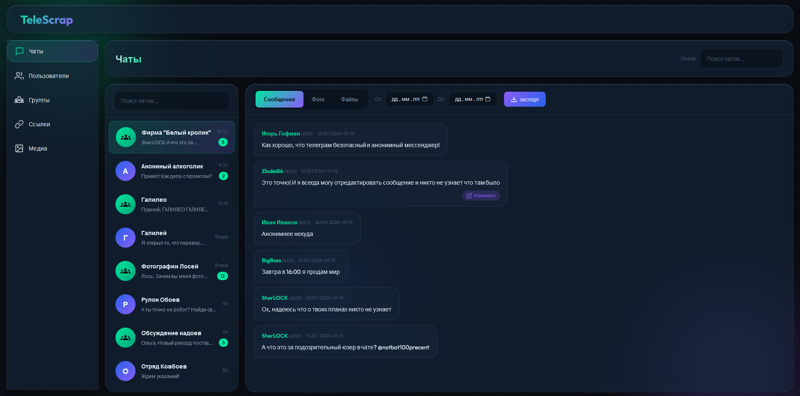

# TeleScrap

 

Скраппер-юзербот для Telegram на Go с интерфейсом для просмотра собранных данных

 

## Функционал

- Сбор сообщений, а так же файлов из каналов или личных сообщений
  
- Сбор информации о профилях пользователей
  
- Просмотр собранных данных через веб-интерфейс
  

## Запуск

Для запуска необходим [Docker](https://docs.docker.com/engine/install/)

- Склонируйте репозиторий с помощью `git clone https://github.com/MxAer/TeleScrap`
  

- Создайте файл со своими переменными для запуска по примеру [.env.example](https://github.com/MxAer/TeleScrap/.env.example)
  

- Введите в терминал, открытый в папке склонированного репозитория `docker compose up -d`
  

- Вы успешно запустили TeleScrap! Веб-интерфейс вы можете найти на порте 6767
